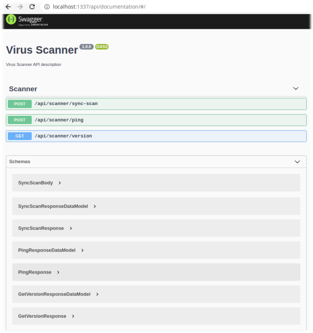

# Virus Scanner

This project is a virus scanner as a microservice with REST interface. It consists of ClamAV and NodeJS client for ClamAV.

## ClamAV

[ClamAV](https://www.clamav.net/) is used as a docker image. It runs:
* `clamd` daemon socket listening on port 3310;
* `freshclam` signature database update tool in the background.

## REST Client

REST Client is a NodeJS application based on [NestJS](https://nestjs.com/) framework. 

## How-To

To run microservice you can use `docker compose`. It will run Scanner service on port 3310 and API service on port 1337.

Usage: 

1. `docker-compose pull`
2. `docker-compose up -d`

  

    The API documentation will be available on endpoint <i>GET <a href="http://localhost:1337/api/documentation" target="_blank" rel="noopener noreferrer">http://localhost:1337/api/documentation</a></i>
  

   
  
  

## Configuring

REST Client configuring is based on environment variables. See all variables [here](nodejs-rest-client/env/.env). In current implementation all variables are required and must be exposed before starting the REST Client.

ClamAV uses [clamd.conf](scanner/clamav/docker/clamd.conf) and [freshclam.conf](scanner/clamav/docker/freshclam.conf) configuration files. You can change these before building the docker image. See the full documentation for [clamd.conf](https://linux.die.net/man/5/clamd.conf) and [freshclam.conf](https://linux.die.net/man/5/freshclam.conf).

## Local Development

To develop locally you can run ClamAV container in the background: `docker-compose up -d scanner`.

To run REST Client manually on your machine need to:
* have NodeJS with version `> 11` and `yarn` installed globally
* enter to the client directory - `cd ./nodejs-rest-client`
* install dependencies - `yarn install`
* build project - `yarn build`
* run project - `yarn start`

To run unit tests use:
* `yarn test:unit`
* `yarn test:unit:coverage`

You can run client with variables from [.env](nodejs-rest-client/env/.env). Use `yarn start:local` command instead `yarn start`.

## Notes

* This project is not production-ready. 
* The running of the `clamd` and `freshclam` can take a little time. So clamav can be unavailable the first 20-30 seconds after starting.
